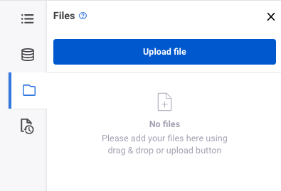

# An introduction to PySpark
### Level: Beginner
### Presentation: (where your audience can find the presentation)

## Project description
PySpark is a distributed data processing engine widely used in Data Engineering and Data Science. Another way to think of PySpark is a library that allows processing large amounts of data on a single machine or a cluster of machines. We will go through the basic concepts and operations so you will leave the workshop ready to continue learning on your own.

## Setup:

Go to `My Notebooks` on your account on https://www.zepl.com/

Click `Import` on the top right corner of the page

Name your notebook and use `Upload file` to import the file on `resources/pyspark.zpln`

On the notebook page, click the folder icon on the left and select `Upload file`

You should be good to start running your notebook now :)

(Pro tip: run a cell with `Shift + Enter`)

## Requirements
Create a trial account on https://www.zepl.com/

## Usage
* Clone the repository
* Follow the instructions to set up your notebook

## Credits
This workshop was set up by @pyladiesams and https://github.com/nataliapipas
