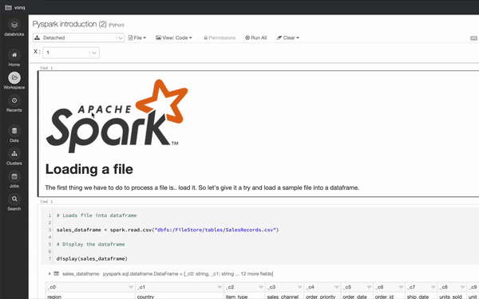
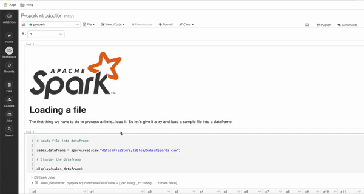
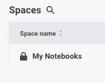
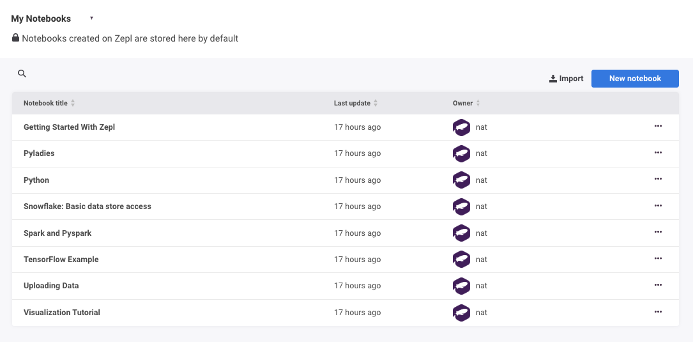

# An introduction to PySpark
### Level: Beginner
### [Presentation](https://docs.google.com/presentation/d/1xRM7Hh1qnqOot1b-HAV_VHsUYl3spUKryE5W2JpPCXw)

## Project description
PySpark is a distributed data processing engine widely used in Data Engineering and Data Science. Another way to think of PySpark is a library that allows processing large amounts of data on a single machine or a cluster of machines. We will go through the basic concepts and operations so you will leave the workshop ready to continue learning on your own.

## Setup:
 
To set up your environment, create an account at https://community.cloud.databricks.com/

Then import the [notebook](https://databricks-prod-cloudfront.cloud.databricks.com/public/4027ec902e239c93eaaa8714f173bcfc/583179271718016/1249435828050903/222117274820398/latest.html) like on the gif:

Upload the file on `workshop/SalesRecords.csv`:

You should be good to go back and start running your notebook now :)

(Pro tip: run a cell with `Shift + Enter`)

## Requirements
Create a trial account on https://community.cloud.databricks.com/

## Usage
* Clone the repository
* Follow the instructions to set up your notebook

## Credits
This workshop was set up by @pyladiesams and https://github.com/nataliapipas

## Plan B

If, for some reason, Databricks is not available, we'll use a Zepl notebook.

Go to `My Notebooks` on your account on https://www.zepl.com/

Click `Import` on the top right corner of the page

Name your notebook and use `Upload file` to import the file on `workshop/pyspark.zpln`
(it can also be found [here](https://www.zepl.com/viewer/notebooks/bm90ZTovL25hdGFsaWFwaXBhc0BnbWFpbC5jb20vZjNkNDgwZjFlNzA4NDc2NTkzZjAxMzQwOThlZWE0MTcvbm90ZS5qc29u)).

On the notebook page, click the folder icon on the left and select `Upload file`

Upload the file on `workshop/SalesRecords.csv`

You should be good to start running your notebook now :)

(Pro tip: run a cell with `Shift + Enter`)